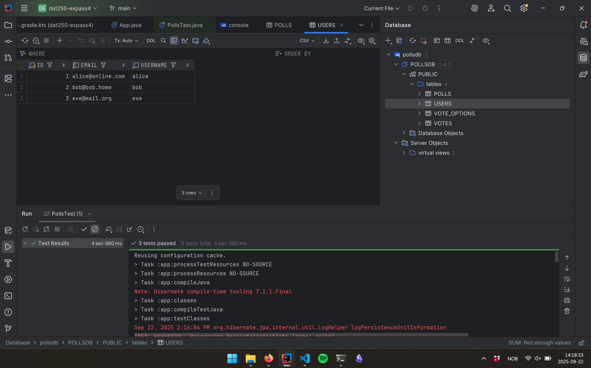
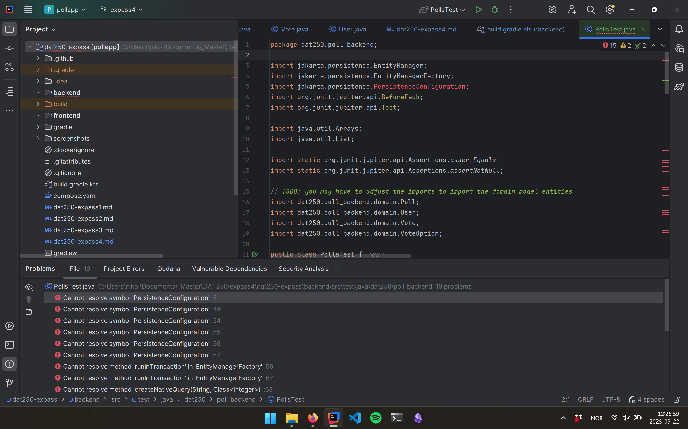

# HVL DAT250 Experiment Assignment 4
- **Name:** Nikolai Hansen Gangstø  
- **User:** nigan4342  
- **Date:** September 2025  

## Code
Code link: [GitHub Repository](https://github.com/nikolaihg/dat250-expass4)  

## Report  

### Step 1  
- Added methods `createPoll` and `voteFor` in **User.java**.  
- Added method `addVoteOption` in **Vote.java**.  
- In **User.java**, I added annotations: `@Entity`, `@Table`, `@Id`, `@GeneratedValue`, `@Column`, and `@OneToMany`.  
- In **Poll.java**, I added JPA annotations and set up the relationships.  
- In **VoteOption.java**, I added JPA annotations with two-way (bidirectional) relationships.  
- In **Vote.java**, I added JPA annotations for the voting relationship.  

### Step 2  
- Ran **PollsTest.java** and all three tests passed.  
- I changed the H2 database URL to:  
```java
  .property(PersistenceConfiguration.JDBC_URL,
            "jdbc:h2:file:C:/Users/nikol/Documents/_Master/DAT250/expass4/dat250-expass4/pollsdb")
````
- This way, I could open and view the database after running the tests.

* Here is the database shown in IntelliJ:
  

### Technical Problems

* After updating the entities with methods and JPA annotations, I got the error:
  **"Cannot resolve symbol 'PersistenceConfiguration'"** in `PollsTest.java`.
  
* I tried fixing it in the same project, but the error stayed.
* Finally, I created a new project using **Gradle init**, copied the files, and then all three tests passed successfully.
